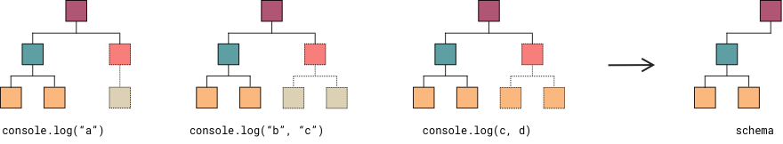

# asteroid

This project is a proof of concept of an algorithm to generate ESLint rules from test cases.

## Algorithm

The idea is to take examples of expressions we want to forbid in the code, compute the Abstract Syntax Tree of each one and remove the differences between the trees. This will result in a partial tree, a _schema_, that can be used to identify the same pattern in new expressions.

### Example

Let’s imagine that we want to forbid the usage of calls to `console.log` in a codebase. We start by adding examples of the invalid code, shown below with their corresponding AST.

1. `console.log("a")`

```yaml
- CallExpression
  - callee: MemberExpression
    - object: Identifier
      - name: "console"
    - property: Identifier
      - name: "log"
  - arguments:
    - 0: Literal
      - value: "a"
```

2. `console.log("b", "c")`

```yaml
- CallExpression
  - callee: MemberExpression
    - object: Identifier
      - name: "console"
    - property: Identifier
      - name: "log"
  - arguments:
    - 0: Literal
      - value: "b"
    - 1: Literal
      - value: "c"
```

3. `console.log(c, d)`

```yaml
- CallExpression
  - callee: MemberExpression
    - object: Identifier
      - name: "console"
    - property: Identifier
      - name: "log"
  - arguments:
    - 0: Identifier
      - name: "c"
    - 1: Identifier
      - value: "d"
```

Starting from the first tree, we compare the tree with the second tree, removing the properties that are not common to both. We use the resulting partial tree with the remaining examples. The final result will be our **schema**.



```yaml
- CallExpression
  - callee: MemberExpression
    - object: Identifier
      - name: "console"
    - property: Identifier
      - name: "log"
```

We can compare this schema with new expressions, like `console.log(a, "b", c)`. Since its AST matches the schema, ESLint should trigger a warning or an error.

## Usage

First, we need to genereate a `schema` from a list of training examples.

```js
const schema = generateSchema([
  "console.log('a')",
  "console.log('b', 'c')",
  "console.log(c, d)"
]);
```

Once we have the schema, we can use it to verify if a given expression is invalid.

```js
const isInvalid = matchRuleBySchema(schema, "console.log(f, g, h)");
```

The idea is to use this to generate ESLint rules from a list of expressions that we don't want to allow.

## Testing

If you want to experiment with this repo, feel free to clone or fork it, add more examples and tweak the algorithm. The [`console-log.test.js`](https://github.com/pnavarrc/asteroid/blob/master/test/console-log.test.js) file has examples on how to use it and how to write more test cases.

```
$ npm install
$ npm run test
```

## License

[MIT](https://github.com/pnavarrc/asteroid/blob/master/LICENSE)
